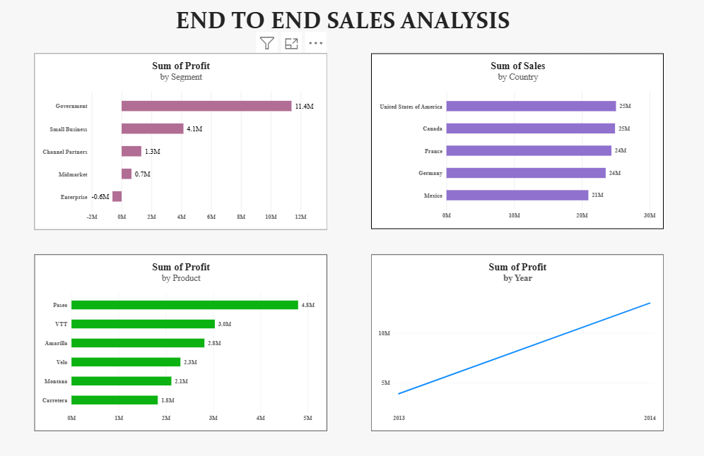

# End-to-End Sales Analysis | Python & PowerBI

## Project Overview
This is my final Data Analyst project where I analyzed sales data using Python for cleaning & analysis and Power BI for dashboard visualization.

The goal I chose was to find which segment, country and product gives most profit and how profit grew from 2013 to 2014.

## Tools Used for this project :
- Python (Pandas, Matplotlib, Seaborn, Numpy)
- Jupyter Notebook
- Power BI Desktop
- Excel

## Dataset
- 700 rows x 14 columns
- Columns: Segment, Country, Product, Discount Band, Units Sold, Sales, Profit, Date etc.
- Raw data file: `Data/raw_data.csv`

## Step by Step implementation for analyzing :
1. **Data Cleaning using Python** - Removed duplicates, checked null values, fixed date format
2. **EDA** - Checked shape (700,14), profit by segment, sales by country
3. **Analysis** - Used Group by operations to find top segment, country, product
4. **Visualization in Python** - Created Bar charts for profit by segment, sales by country
5. **Excel Report** - Created 4 tables for Power BI visualization : Segment_Profit, Country_Sales, Product_Profit, Yearly_Profit
6. **Power BI Dashboard** - Made 4 visuals : Profit by Segment, Sales by Country, Profit by Product, Profit by Year

## Key Insights Found (Main Findings)
1. **Government segment is most profitable - $11.4M**, while Enterprise is in loss -$0.6M. Suggested to focus more on Government and Small Business.
2. **USA is top country with $25M sales**, followed by Canada $24.8M. USA + Canada = 42% of total sales.
3. **Paseo is star product with $4.79M profit**, highest among all products. Carretera is lowest.
4. **Yearly Growth is 235%** - Profit grew from $3.8M in 2013 to $13M in 2014. Business is growing very fast.

## Power BI Dashboard

*Made 4 charts: Profit by Segment, Sales by Country, Profit by Product, Profit by Year*

## Process to run this Project
1. Open `Jupyter Notebook/Sales_Analysis_End_to_End.ipynb` in VS Code / Jupyter.
2. Run all cells - it will create cleaned_dataset and excel_report
3. Open `PowerBI/PowerBI_DashBoard.pbix` in Power BI Desktop
4. Dashboard is ready!

## Author
Rakshita Munnolli - Aspiring Data Analyst
- Skills : Python, SQL, Power BI, Excel